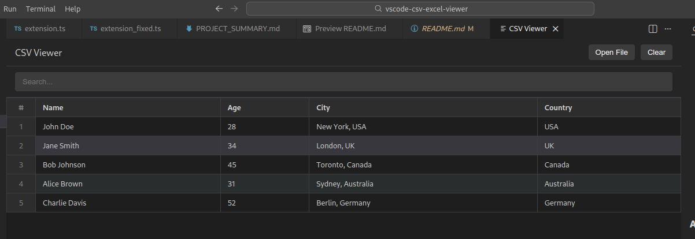

# CSV & Excel Viewer

A lightweight and efficient Visual Studio Code extension to view CSV and Excel files directly within your editor. No need to switch to external spreadsheet software!

## ✨ Features

- **Seamless Viewing**: View `.csv`, `.xlsx`, and `.xls` files in a dedicated, high-performance webview.
- **Integrated Search**: Quickly find specific data within your spreadsheet using the built-in search bar.
- **Activity Bar Integration**: Access the viewer easily through a dedicated icon in the VS Code Activity Bar.
- **Context Menu Support**: Right-click any CSV or Excel file in your Explorer to open it instantly in the viewer.
- **Lightweight**: Built with performance in mind, ensuring smooth scrolling and quick loading even for larger files.
- **Custom Icons**: Enhanced file visibility with dedicated icons for CSV and Excel files in your explorer.

## 🚀 Installation

### From the Marketplace
1. Open VS Code.
2. Go to the **Extensions** view (click the square icon on the left sidebar or press `Ctrl+Shift+X`).
3. Search for `CSV & Excel Viewer`.
4. Click **Install**.

### From Source (For Developers)
1. Clone this repository:
   ```bash
   git clone https://github.com/GabrielIkpolo/csv-excel-viewer.git
   ```
2. Navigate to the directory:
   ```bash
   cd csv-excel-viewer
   ```
3. Install dependencies:
   ```bash
   npm install
   ```
4. Press `F5` to launch a new VS Code window with the extension loaded.

## 🛠 Usage

### Method 1: Explorer Context Menu (Easiest)
- Right-click on any `.csv`, `.xlsx`, or `.xls` file in your file explorer.
- Select **"Open in CSV/Excel Viewer"**.

### Method 2: Activity Bar
- Click the **CSV/Excel Viewer** icon in the Activity Bar on the left side of VS Code.
- Use the commands within the viewer to open files.

### Method 3: Command Palette
- Press `Ctrl+Shift+P` (or `Cmd+Shift+P` on macOS).
- Type and select one of the following:
    - `Open CSV Viewer`
    - `Open Excel Viewer`
    - `Open in CSV/Excel Viewer`

## ⌨️ Commands

| Command | Description |
| --- | --- |
| `csvExcelViewer.openCsv` | Opens the dedicated CSV viewer panel. |
| `csvExcelViewer.openExcel` | Opens the dedicated Excel viewer panel. |
| `csvExcelViewer.openFile` | Opens a file dialog to select a CSV or Excel file. |

## 📸 Screenshots




## 🤝 Contributing

Contributions are welcome! If you find a bug or have a feature request, please open an issue or submit a pull request.

1. Fork the repository.
2. Create your feature branch: `git checkout -b feature/AmazingFeature`.
3. Commit your changes: `git commit -m 'Add some AmazingFeature'`.
4. Push to the branch: `git push origin feature/AmazingFeature`.
5. Open a Pull Request.

## 📄 License

This project is licensed under the MIT License - see the [LICENSE](LICENSE) file for details.
